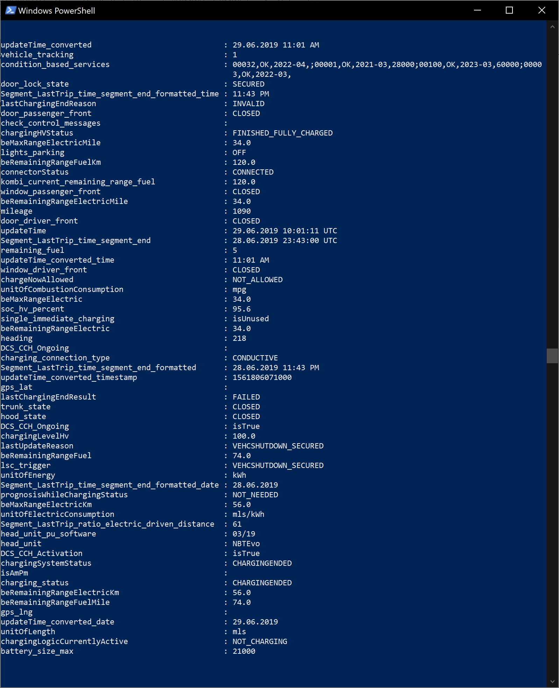

# bmw-powershell
Query BMW's Connected Drive API for information about your vehicle and services.

You will need an account on the BMW Connected Drive site, with at least one vehicle added to your account: https://www.bmw-connecteddrive.co.uk/app/index.html

### Getting Started
Create a BMWConfig.ps1 based on the -dist copy in the repo, and put your BMW Connected Drive credentials in it along with the VIN of your vehicle.  (If you have multiple vehicles, I leave parameterising this as an exercise for the reader!)

The script behaviour is mostly self evident. If, like me, you just want to grab a quick snapshot of the state of the car (lock status, charge, last journey etc), use the Get-BMWInfo.ps1 file - this will return an object with everything you need:

### Compatibility

I built these scripts by watching the API in action on the web interface for my account - so some stuff may be particular to my i8.